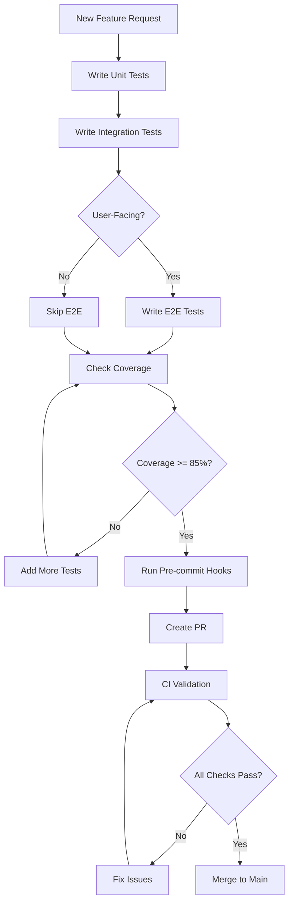
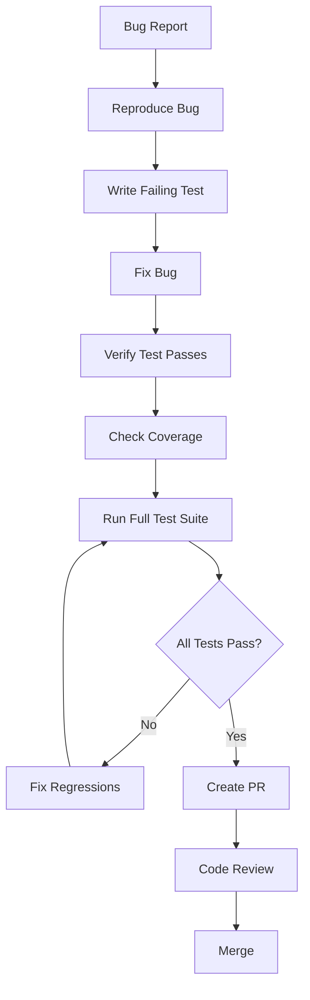

# AgentSkill: Test Writing & Maintenance Rules

**Skill ID**: `agent-hub-testing`  
**Version**: 1.0.0  
**Description**: Enforce test writing and maintenance standards for Agent Hub project  
**Applies to**: All new features, feature updates, and bug fixes

---

## Skill Definition

```yaml
name: agent-hub-testing
version: 1.0.0
description: >
  Ensures all code changes include appropriate tests following project standards.
  This skill validates test coverage, quality, and maintenance requirements.

triggers:
  - "new feature"
  - "feature update"
  - "bug fix"
  - "PR created"
  - "code change"

requirements:
  - unit_tests_required: true
  - integration_tests_required: true
  - e2e_tests_required: conditional
  - coverage_minimum: 85%
  - test_naming_convention: enforced
  - mocking_external_services: required
```

---

## Test Writing Rules

### Rule 1: Test Pyramid Compliance ✅

**Requirement**: Follow the test pyramid for all new features

```
        ╱╲
       ╱  ╲         E2E Tests (10%)
      ╱────╲
     ╱      ╲       Integration Tests (20%)
    ╱────────╲
   ╱          ╲     Unit Tests (70%)
  ╱────────────╲
```

**Checklist**:
- [ ] Unit tests for all new services/functions
- [ ] Integration tests for API endpoints
- [ ] E2E tests for critical user flows (if user-facing)
- [ ] Ratio approximately 70/20/10

**Validation**:
```bash
# Count tests by type
find . -name "*.test.ts" -path "*/__tests__/*" | wc -l  # Unit
find . -name "*.test.ts" -path "*/integration/*" | wc -l  # Integration
find . -name "*.spec.ts" -path "*/e2e/*" | wc -l  # E2E
```

---

### Rule 2: Unit Test Requirements ✅

**Required for**:
- All new service methods
- All utility functions
- All middleware
- All business logic

**Template**:
```typescript
// src/services/__tests__/NewService.test.ts
import { NewService } from '../NewService';

describe('NewService', () => {
  let service: NewService;

  beforeEach(() => {
    service = new NewService();
  });

  describe('methodName', () => {
    it('should [expected behavior] when [condition]', async () => {
      // Arrange
      const input = 'test input';
      
      // Act
      const result = await service.methodName(input);
      
      // Assert
      expect(result).toBeDefined();
      expect(result).toEqual(expectedOutput);
    });

    it('should handle edge case: [describe edge case]', async () => {
      // Test edge case
    });

    it('should throw error when [invalid input]', async () => {
      // Test error handling
      await expect(service.methodName(invalidInput))
        .rejects.toThrow('Expected error message');
    });
  });
});
```

**Naming Convention**:
```typescript
// Format: should [expected behavior] when [condition]
it('should select mentioned agent with 100% priority when @mention is present');
it('should skip agents on cooldown when checking @mentions');
it('should throw ValidationError when message content is empty');
```

**Checklist**:
- [ ] Test file created next to source file
- [ ] Describe blocks for each method
- [ ] Multiple test cases per method (happy path + edge cases)
- [ ] Descriptive test names following convention
- [ ] Arrange-Act-Assert pattern followed
- [ ] No test logic in source files

---

### Rule 3: Integration Test Requirements ✅

**Required for**:
- All new API endpoints
- Database operations
- External service integrations (OpenClaw, Feishu)
- WebSocket events

**Template**:
```typescript
// tests/integration/api/newFeature.test.ts
import request from 'supertest';
import { app } from '../../src/index';

describe('New Feature API', () => {
  describe('POST /api/new-endpoint', () => {
    it('should create resource and return 201', async () => {
      const response = await request(app)
        .post('/api/new-endpoint')
        .send({ /* test data */ })
        .expect(201);
      
      expect(response.body.id).toBeDefined();
      expect(response.body).toMatchObject({ /* expected shape */ });
    });

    it('should validate input and return 400 for invalid data', async () => {
      await request(app)
        .post('/api/new-endpoint')
        .send({ /* invalid data */ })
        .expect(400);
    });

    it('should require authentication', async () => {
      await request(app)
        .post('/api/new-endpoint')
        .send({ /* data */ })
        .expect(401);
    });
  });
});
```

**Checklist**:
- [ ] Test file in `tests/integration/` directory
- [ ] Uses Supertest for HTTP testing
- [ ] Tests success and error cases
- [ ] Tests authentication/authorization
- [ ] Database cleaned between tests
- [ ] External services mocked

---

### Rule 4: E2E Test Requirements (Conditional) ✅

**Required when**:
- New user-facing feature
- Critical user flow changed
- Multiple components interact
- Cross-feature integration

**Not required for**:
- Backend-only changes
- Refactoring without behavior change
- Performance optimizations
- Bug fixes with existing E2E coverage

**Template**:
```typescript
// tests/e2e/new-feature.spec.ts
import { test, expect } from '@playwright/test';

test.describe('New Feature', () => {
  test('should complete critical user flow', async ({ page }) => {
    // 1. Navigate to feature
    await page.goto('http://localhost:3000/path');
    
    // 2. Wait for page load
    await page.waitForSelector('.feature-container');
    
    // 3. Perform user action
    await page.fill('input', 'test data');
    await page.click('button:has-text("Submit")');
    
    // 4. Verify outcome
    await page.waitForSelector('.success-message', { timeout: 5000 });
    await expect(page.locator('.success-message')).toBeVisible();
  });

  test('should handle error state gracefully', async ({ page }) => {
    // Test error handling
  });
});
```

**Checklist**:
- [ ] Test file in `tests/e2e/` directory
- [ ] Tests critical user flow
- [ ] Uses proper waits (no arbitrary timeouts)
- [ ] Verifies both success and error states
- [ ] Test completes in < 30 seconds
- [ ] Screenshots on failure enabled

---

### Rule 5: Code Coverage Requirements ✅

**Minimum Coverage**:
- Overall: 85%
- Services: 90%
- Middleware: 95%
- Routes: 85%
- Utilities: 80%

**Validation**:
```bash
# Run tests with coverage
npm run test:coverage

# Check coverage meets thresholds
npm run test:coverage:check
```

**Configuration** (`jest.config.js`):
```javascript
module.exports = {
  coverageThreshold: {
    global: {
      branches: 80,
      functions: 80,
      lines: 80,
      statements: 80
    },
    './src/services/': {
      branches: 90,
      functions: 90,
      lines: 90,
      statements: 90
    },
    './src/middleware/': {
      branches: 95,
      functions: 95,
      lines: 95,
      statements: 95
    }
  }
};
```

**Checklist**:
- [ ] Coverage thresholds met
- [ ] No critical paths uncovered
- [ ] Coverage report reviewed
- [ ] Missing coverage documented (if intentional)

---

### Rule 6: Mocking External Services ✅

**Required for**:
- OpenClaw API calls
- Feishu API calls
- Database operations (in unit tests)
- Third-party services

**Template**:
```typescript
// tests/__mocks__/OpenClawService.ts
export const mockOpenClawService = {
  sendMessage: jest.fn().mockResolvedValue({
    content: 'Mocked AI response',
    usage: { totalTokens: 100, cost: 0.001 }
  })
};

// In test file
jest.mock('../../src/services/OpenClawService');

describe('Feature using OpenClaw', () => {
  it('should handle OpenClaw response', async () => {
    // Test uses mock, not real API
    const result = await service.callOpenClaw();
    expect(result.content).toBe('Mocked AI response');
  });
});
```

**Checklist**:
- [ ] External services mocked in unit tests
- [ ] Mocks defined in `tests/__mocks__/`
- [ ] Mock responses realistic
- [ ] Mock error scenarios tested
- [ ] Integration tests use real services (when safe)

---

### Rule 7: Test Data Management ✅

**Requirements**:
- Use factories for dynamic data
- Use fixtures for static data
- Reset database between tests
- No hardcoded test data in test files

**Template**:
```typescript
// tests/factories/messageFactory.ts
export function createMessage(overrides = {}) {
  return {
    id: crypto.randomUUID(),
    content: 'Test message',
    senderType: 'human',
    roomId: 'test-room',
    createdAt: new Date(),
    ...overrides
  };
}

// tests/fixtures/agents.ts
export const testAgents = {
  mom: { id: 'family-mom', name: 'Mom', role: 'mother' },
  dad: { id: 'family-dad', name: 'Dad', role: 'father' },
};

// Usage in test
import { createMessage } from '../factories/messageFactory';
import { testAgents } from '../fixtures/agents';

const message = createMessage({ content: 'Custom', senderType: 'agent' });
```

**Checklist**:
- [ ] Factories used for dynamic data
- [ ] Fixtures used for static data
- [ ] Database reset in `beforeEach`
- [ ] No shared state between tests
- [ ] Test data isolated per test

---

### Rule 8: Test Documentation ✅

**Required**:
- README in `tests/` directory
- Decision log for major test choices
- Inline comments for complex test logic

**Template** (`tests/README.md`):
```markdown
# Test Suite Documentation

## Running Tests

```bash
npm test              # All tests
npm run test:unit     # Unit tests
npm run test:e2e      # E2E tests
```

## Test Structure

- Unit: `src/**/__tests__/*.test.ts`
- Integration: `tests/integration/**/*.test.ts`
- E2E: `tests/e2e/**/*.spec.ts`

## Writing New Tests

See docs/TEST-WRITING-RULES.md for standards.
```

**Checklist**:
- [ ] tests/README.md exists and up-to-date
- [ ] Complex tests have inline comments
- [ ] Test decisions documented
- [ ] Examples provided for common patterns

---

## Maintenance Rules

### Rule 9: Flaky Test Management ✅

**Requirements**:
- No flaky tests in main branch
- Flaky tests quarantined immediately
- Root cause fixed within 24 hours

**Process**:
```typescript
// Quarantine flaky test
describe.skip('Flaky: Agent Response Timing', () => {
  it('should respond within 30 seconds', async () => {
    // Under investigation - DO NOT RUN
  });
});

// Add to flaky tests tracker
// docs/FLAKY-TESTS.md
```

**Checklist**:
- [ ] Flaky test identified and skipped
- [ ] Issue created with investigation details
- [ ] Root cause documented
- [ ] Fix implemented and test re-enabled
- [ ] Flaky test tracker updated

---

### Rule 10: Test Performance ✅

**Requirements**:
- Unit tests: < 100ms per test
- Integration tests: < 1s per test
- E2E tests: < 30s per test
- Full suite: < 10 minutes

**Monitoring**:
```bash
# Check slow tests
npm test -- --verbose --no-coverage | grep -E "^\s*[0-9]+ms"

# Generate test timing report
npm run test:timing
```

**Checklist**:
- [ ] Test execution time monitored
- [ ] Slow tests optimized
- [ ] Tests run in parallel
- [ ] Database queries optimized
- [ ] Unnecessary waits removed

---

### Rule 11: Test Review Process ✅

**PR Requirements**:
- Tests included for all changes
- Test code reviewed alongside source code
- Coverage maintained or improved

**PR Template** (`.github/PULL_REQUEST_TEMPLATE.md`):
```markdown
## Test Checklist
- [ ] Unit tests added/updated
- [ ] Integration tests added/updated
- [ ] E2E tests added/updated (if applicable)
- [ ] All tests passing locally
- [ ] Coverage maintained or improved
- [ ] No flaky tests introduced

## Test Evidence
Paste test output:
```bash
npm test
# Paste output here
```
```

**Checklist**:
- [ ] Tests reviewed in PR
- [ ] Test quality assessed
- [ ] Naming convention followed
- [ ] Mocks used appropriately
- [ ] Edge cases covered

---

### Rule 12: Continuous Integration ✅

**Requirements**:
- Tests run on every PR
- Coverage threshold enforced
- Flaky tests reported
- Test reports generated

**CI Configuration** (`.github/workflows/ci.yml`):
```yaml
name: CI/CD Pipeline

on:
  push:
    branches: [main, develop]
  pull_request:
    branches: [main]

jobs:
  test:
    runs-on: ubuntu-latest
    steps:
      - uses: actions/checkout@v3
      - uses: actions/setup-node@v3
        with:
          node-version: '18'
          cache: 'npm'
      - run: npm ci
      - run: npm run test:coverage
      - run: npm run test:coverage:check
      - run: npm run test:e2e
      - uses: codecov/codecov-action@v3
        with:
          files: ./coverage/coverage-final.json
```

**Checklist**:
- [ ] Tests run in CI on every PR
- [ ] Coverage threshold enforced
- [ ] Test reports uploaded
- [ ] Flaky tests detected
- [ ] CI pipeline < 15 minutes

---

## Enforcement Mechanisms

### Pre-commit Hook

```json
// package.json
{
  "husky": {
    "hooks": {
      "pre-commit": "lint-staged",
      "pre-push": "npm run test:ci"
    }
  },
  "lint-staged": {
    "*.ts": [
      "eslint --fix",
      "jest --findRelatedTests --bail --passWithNoTests"
    ]
  }
}
```

### CI Checks

```yaml
# .github/workflows/test-validation.yml
name: Test Validation

on:
  pull_request:
    branches: [main]

jobs:
  validate-tests:
    runs-on: ubuntu-latest
    steps:
      - uses: actions/checkout@v3
      - run: npm ci
      - run: npm run test:coverage:check
      - run: npm run test:validate-rules
```

### Automated Validation Script

```typescript
// scripts/validate-tests.ts
import { execSync } from 'child_process';

console.log('🔍 Validating test rules...');

// Check 1: Coverage threshold
try {
  execSync('npm run test:coverage:check', { stdio: 'inherit' });
  console.log('✅ Coverage threshold met');
} catch (error) {
  console.error('❌ Coverage threshold not met');
  process.exit(1);
}

// Check 2: Test file naming
// Check 3: Test naming convention
// Check 4: Mock usage
// Check 5: Test documentation

console.log('✅ All test rules validated');
```

---

## Skill Enforcement Workflow

### For New Features



### For Bug Fixes



---

## Quick Reference

### Test Writing Checklist

```markdown
## Before Committing

### Unit Tests
- [ ] Test file created in `src/**/__tests__/`
- [ ] All new methods tested
- [ ] Edge cases covered
- [ ] Error scenarios tested
- [ ] Naming convention followed
- [ ] Mocks used for external services

### Integration Tests
- [ ] API endpoints tested
- [ ] Database operations tested
- [ ] Authentication tested
- [ ] Success and error cases covered

### E2E Tests (if applicable)
- [ ] Critical flow tested
- [ ] Proper waits (no setTimeout)
- [ ] Success and error states verified
- [ ] Test completes in < 30s

### Coverage
- [ ] Overall >= 85%
- [ ] Services >= 90%
- [ ] Middleware >= 95%
- [ ] Coverage report reviewed

### Documentation
- [ ] Complex tests have comments
- [ ] Test README updated
- [ ] Decision log updated (if major change)
```

### Common Commands

```bash
# Run all tests
npm test

# Run with coverage
npm run test:coverage

# Check coverage thresholds
npm run test:coverage:check

# Run specific test file
npm test -- MessageService.test.ts

# Watch mode (TDD)
npm run test:watch

# E2E tests
npm run test:e2e

# E2E headed (see browser)
npm run test:e2e:headed

# Validate all test rules
npm run test:validate-rules
```

---

## Version History

| Version | Date | Changes |
|---------|------|---------|
| 1.0.0 | 2026-04-02 | Initial version with 12 rules |

---

## Related Documents

- [`docs/AUTOMATED-TESTING-STRATEGY.md`](AUTOMATED-TESTING-STRATEGY.md) - Testing strategy overview
- [`docs/TEST-MAINTENANCE-GUIDE.md`](TEST-MAINTENANCE-GUIDE.md) - Maintenance best practices
- [`tests/README.md`](../tests/README.md) - Test suite documentation
- [`.github/PULL_REQUEST_TEMPLATE.md`](../.github/PULL_REQUEST_TEMPLATE.md) - PR checklist

---

**Skill Owner**: Development Team  
**Last Review**: 2026-04-02  
**Next Review**: 2026-07-02 (Quarterly)

**Enforcement**: These rules are automatically checked via CI/CD pipeline and pre-commit hooks. Violations block merges to main branch.
